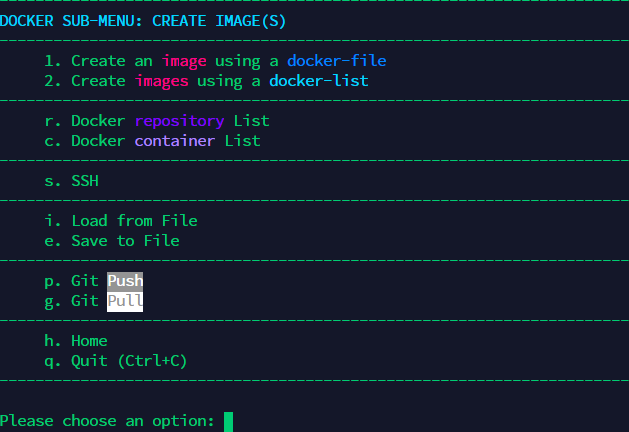
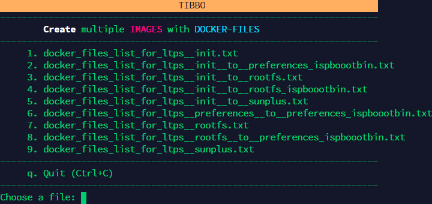
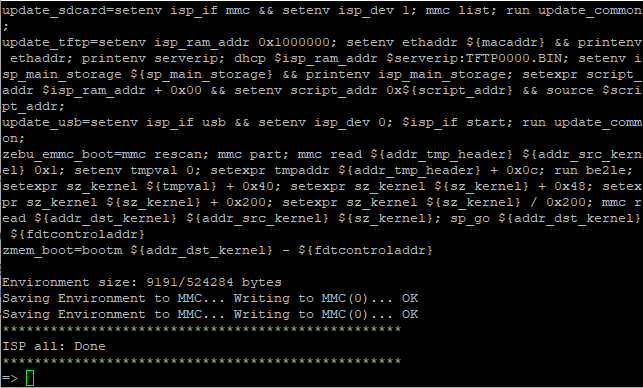

# Building Tibbo's Ubuntu-Based Distribution Images

## Introduction
This repository contains scripts and other tools used to create customized version of Tibbo's [Ubuntu-based distribution](https://tibbo.com/store/tps/ltpp3g2/ubuntu.html).

## System Requirements 
* At least 35GB of hard drive space (50GB recommended)
* A clean installation of Ubuntu Server 20.04
  * Ubuntu Desktop 20.04 is viable, but is a significantly larger download and install
  * Installation via a virtual machine is supported
    * A virtual bridge is highly recommended (not necessary if running Hyper-V)

## Getting Started
After installing Ubuntu, log in with the username you specified during the setup process.

You will need to install several packages to build images:
* Git
* Docker
* qemu-user-static

To do so, run the following commands:

``` shell
sudo apt-get update
sudo apt-get install git docker.io qemu-user-static
sudo mkdir /repo
sudo chown $USER /repo
cd /repo
git clone= https://github.com/tibbotech/LTPP3_ROOTFS.git
```

<br>

***

<br>

## Building 

<br>

We have created a script designed to simplify and automate most of the process of building images. To access it, run the following commands:

``` shell
cd LTPP3_ROOTFS
sudo ./docker_mainmenu.sh
```

You will be presented with an interactive menu, as illustrated below.


Select option #1 (type `1`). This will take you to a submenu, as illustrated below.



Select option #2 (type `2`). This will provide a list of options for builds, as illustrated below.



The base build that includes the core Ubuntu components, SP7021-specific software, and Tibbo's customizations, as well as the image binary, is #4 (type `4`): rootfs_ispboootbin.txt.

You will be asked to confirm whether you wish to continue.
Type `y` — no need to press `Enter`. 

This will begin the process of downloading the various files needed to build images. As some of these files are very large (up to nearly 10GB), how long this process takes is highly dependent on your Internet connection, as well as your processor and storage speed.

<br>

***

<br>

## Getting the Binary 

After the script completes successfully, the images containing the different steps of the build process are displayed.

You will now be back at the main menu of the interactive script.


Select option #4 (type `4`). This will take you to a submenu, as illustrated below.


Type the name of image you want to use; in this case, that would be `ltps_rootfs_ispboootbin`.

At the subsequent prompt, type the name of the tag you want to use. To use the default ("latest"), just press `Enter`.

After the container is created, a summary will show the IP address and port you can use to SSH into it.


You can also SFTP into the container (at the same IP address and port) to extract the image.

The `ISPBOOOT.bin` file used to image an LTPP3(G2) is located in `/root/SP7021/out`.

### Scripted Extraction
Alternatively, the script can also extract the file for you.


At the main menu, enter `8`, which takes you to a submenu.

You can specify which file to extract or insert into the container. In this case, you'll want to type `1` to extract the image. 

You will be asked for the container ID, source directory, filename, and destination directory. Pressing `Enter` at these prompts will use the default value.

You will be prompted to confirm that you want to continue. Type `y`.


<br>

***

<br>

# Updating LTPP3(G2) Firmware
Now that you have a functional image for your device, it's time to flash the board.

## Requirements
* Physical access to the device
* A power supply for the board
* A USB flash drive
* A jumper or jump wire

If you want to monitor the progress of the operation, you will also need a USB cable with a Type-C connector.

## Step-by-Step Instructions
Before you begin, if the device is in an enclosure — such as an LTPB3 — you will need to remove the "top" cover to access the board.

If you plan on monitoring the progress of the operation, first connect your computer to the LTPP3(G2) board with the USB cable. There is a built-in serial console port (USB Type-C) behind the USB Type-A ports. Then open your preferred terminal application (e.g., IO Ninja or Putty) and prepare to open the port.

1. Copy **ISPBOOOT.BIN** to the USB flash drive.
2. Place the jumper on CN11 (perpendicular to the nearest edge of the board). This is located on the "right" side of the board next to the MD and RST buttons.
3. Insert the USB flash drive into the USB Type-A port **next to the HDMI port**.
4. Power on the device.

_(Optional)_ You can now open the port on your preferred terminal application to monitor the progress of the operation.



If you're monitoring via a terminal, you'll see "ISP all: Done" (as illustrated in the image above) when the update is complete.

At this point, you should:
1. Power off the device.
2. Remove the USB flash drive.
3. Remove the jumper
4. Press the RST button to restart the device.
5. _(Optional)_ Replace the "top" cover if you're using an enclosure.

Enjoy our Ubuntu-based distribution on your LTPP3(G2).